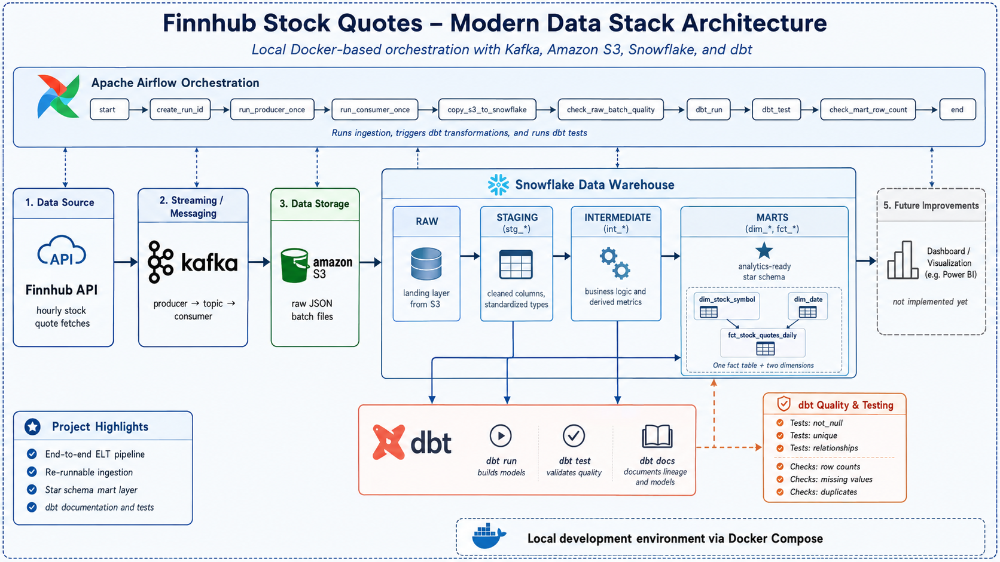
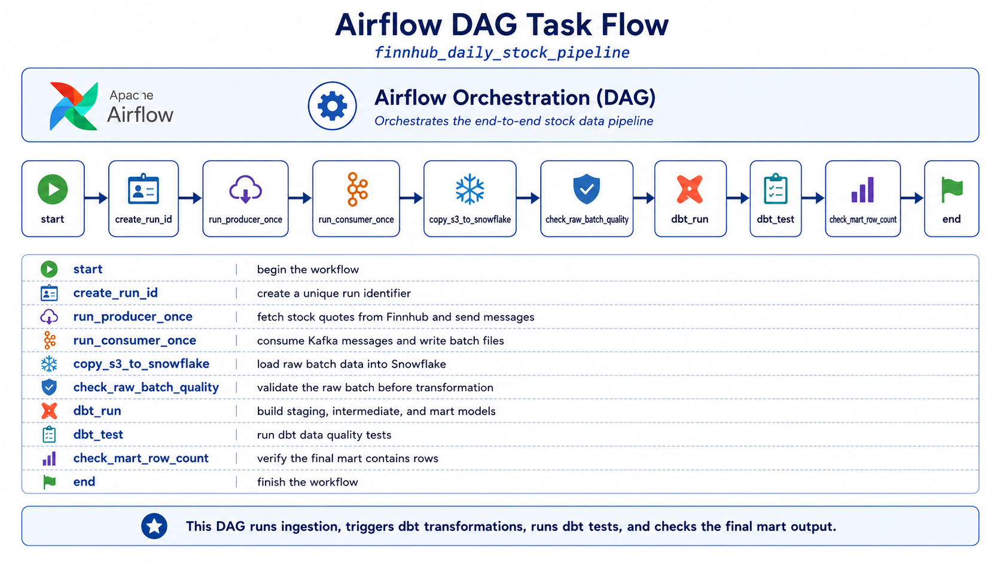
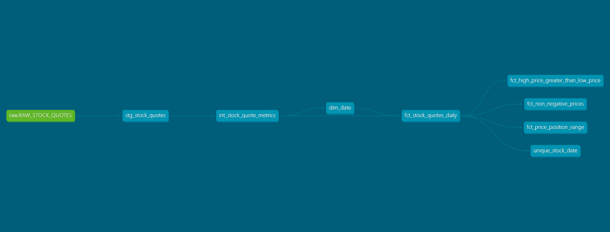
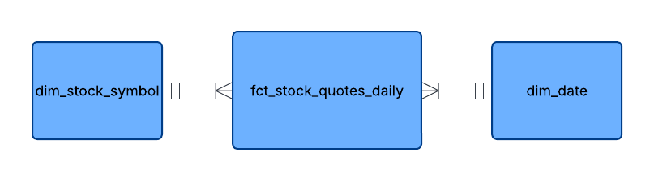
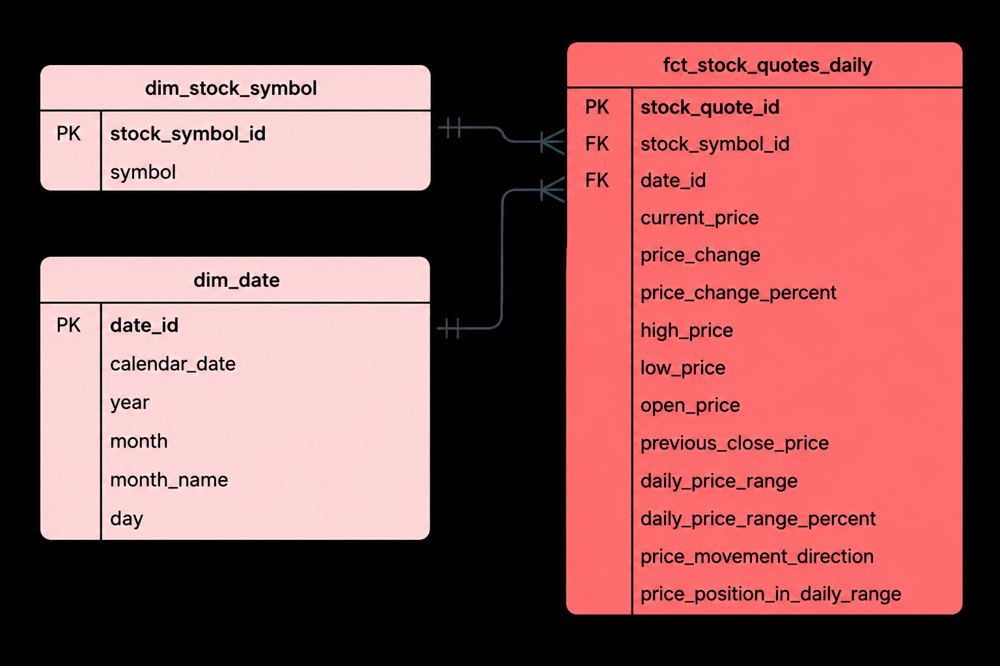
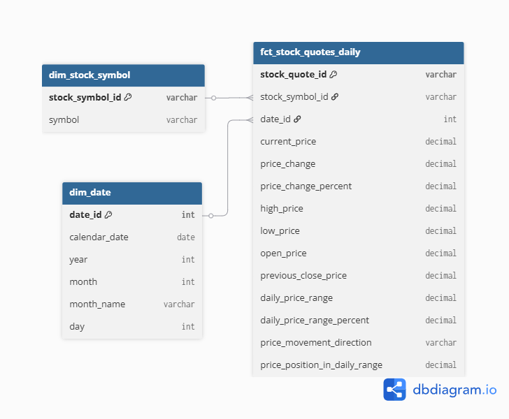

# Stock Market Finnhub

This project is a small-scale modern data stack pipeline built with Finnhub stock quote data. The pipeline ingests stock quote data, stores the raw files in Amazon S3, loads the data into Snowflake, and transforms it with dbt into structured raw, staging, intermediate, and marts layers.

The final mart layer is designed as an analytics-ready star schema with dimension tables for stock symbols and dates, plus a daily fact table for stock quote metrics. 

Airflow orchestrates the workflow by running ingestion, triggering dbt transformations, and executing dbt tests. The project also includes data quality checks such as not_null, unique, relationship tests, missing value checks, duplicate checks, and row count validation.

## Architecture

## 🛠️ Tools

<table>
  <tr>
    <td align="center" width="130">
      
       <strong>Kafka</strong>
       Data ingestion
    </td>
    <td align="center" width="130">
      <strong style="font-size: 28px;">S3</strong>
       <strong>Amazon S3</strong>
       Raw data storage
    </td>
    <td align="center" width="130">
      
       <strong>Snowflake</strong>
       Data warehouse
    </td>
    <td align="center" width="130">
      <strong style="font-size: 28px;">dbt</strong>
       <strong>dbt</strong>
       Transformations & tests
    </td>
    <td align="center" width="130">
      
       <strong>Apache Airflow</strong>
       Workflow orchestration
    </td>
  </tr>
</table>

## Dataset
**API stock market website:** https://finnhub.io/

**Finnhub Review** offers a deep dive into a compelling financial data platform designed for developers, investors, academics, and fintech innovators. As a modern, RESTful and WebSocket-enabled API, Finnhub delivers real-time and historical financial market data, alternative data sets, and comprehensive company fundamentals. 

Finnhub Free: 60 calls/min + free WebSocket, good data (watch pre-market volume), best for real-time

## Repository map

| Area | Actual path(s) |
| --- | --- |
| dbt project | [`finnhub_stocks/`](finnhub_stocks/) |
| Airflow DAG for the real pipeline | [`dags/02_finnhub_daily_pipeline.py`](dags/02_finnhub_daily_pipeline.py) |
| Producer scripts | [`producer.py`](producer/producer.py) runs continuous Kafka ingestion, while [`producer_once.py`](producer/producer_once.py) runs one controlled ingestion cycle for Airflow testing and DAG execution. I am using `producer_once.py`|
| Consumer scripts | [`consumer.py`](consumer/consumer.py) is for continuous Kafka consumption, while [`consumer_once.py`](consumer/consumer_once.py) is for one-time consumption used by Airflow. |
| Python requirements | [`requirements.txt`](requirements.txt) |
| Local Docker Compose setup | [`docker-compose.yml`](docker-compose.yml) |
| Optional Terraform infrastructure-as-code | [`terraform/`](terraform/) provisions the raw S3 bucket plus Snowflake database, warehouse, and layer schemas. |
| dbt Snowflake profile | [`finnhub_stocks/profiles.yml`](finnhub_stocks/profiles.yml) |
| dbt staging models | [`finnhub_stocks/models/staging/`](finnhub_stocks/models/staging/) |
| dbt intermediate models | [`finnhub_stocks/models/intermediate/`](finnhub_stocks/models/intermediate/) |
| dbt marts models | [`finnhub_stocks/models/marts/`](finnhub_stocks/models/marts/) |
| dbt source/schema YAML files | [`finnhub_stocks/models/staging/sources.yml`](finnhub_stocks/models/staging/sources.yml), [`finnhub_stocks/models/staging/schema.yml`](finnhub_stocks/models/staging/schema.yml), [`finnhub_stocks/models/intermediate/schema.yml`](finnhub_stocks/models/intermediate/schema.yml), [`finnhub_stocks/models/marts/schema.yml`](finnhub_stocks/models/marts/schema.yml) |
| dbt custom SQL tests | [`finnhub_stocks/tests/intermediate/`](finnhub_stocks/tests/intermediate/), [`finnhub_stocks/tests/marts/`](finnhub_stocks/tests/marts/) |

> Note: this repository uses a local `.env` file through Docker Compose, but no `.env.example` file is currently present in the repo. Do not commit real API keys, cloud credentials, or Snowflake passwords.

## Orchestration with Airflow

Apache Airflow coordinates the end-to-end daily stock quote pipeline in this project. Instead of running every script by hand, Airflow defines the pipeline as a DAG that runs the producer, consumer, Snowflake load, dbt transformations, and quality checks in the correct order.

Airflow runs locally through [`docker-compose.yml`](docker-compose.yml). The Compose setup starts the Airflow webserver and scheduler, mounts the project folders into the Airflow containers, and makes the DAG available from [`dags/02_finnhub_daily_pipeline.py`](dags/02_finnhub_daily_pipeline.py).

Because this is a local Docker-based setup, scheduled DAG runs only happen while the local machine is on and the Docker Compose environment is running. For demos and testing, trigger the DAG manually from the Airflow UI.

- **DAG name:** `finnhub_daily_stock_pipeline`
- **DAG file:** [`dags/02_finnhub_daily_pipeline.py`](dags/02_finnhub_daily_pipeline.py)
- **Schedule:** hourly (`0 * * * *`)
- **Catchup:** disabled, so Airflow does not backfill missed historical runs by default.

### DAG task flow

| Task | Function |
| --- | --- |
| `start` | Marks the beginning of the pipeline run. |
| `create_run_id` | Creates a deterministic run ID from the Airflow logical date so the batch can be tracked across producer, consumer, Snowflake, and quality checks. |
| `run_producer_once` | Runs [`producer/producer_once.py`](producer/producer_once.py) once to fetch quotes from Finnhub and publish them to the Kafka `stock_quotes` topic. |
| `run_consumer_once` | Runs [`consumer/consumer_once.py`](consumer/consumer_once.py) once to consume the matching Kafka batch and upload it to S3 as JSONL. |
| `copy_s3_to_snowflake` | Copies staged JSONL quote records from S3 into Snowflake's raw `raw_stock_quotes` table. |
| `check_raw_batch_quality` | Validates the raw batch row count, symbol coverage, required fields, and duplicate symbols for the current run ID. |
| `dbt_run` | Runs `dbt run` inside [`finnhub_stocks/`](finnhub_stocks/) to build the staging, intermediate, and marts models in Snowflake. |
| `dbt_test` | Runs `dbt test` inside [`finnhub_stocks/`](finnhub_stocks/) to execute schema tests and custom SQL tests. |
| `check_mart_row_count` | Confirms that the final marts fact table contains rows for the batch's fetched date. |
| `end` | Marks successful completion of the pipeline run. |

### Lineage Graph from dbt docs

## Data Modelling

### Conceptual Model

### Logical Model

### Physical Model
